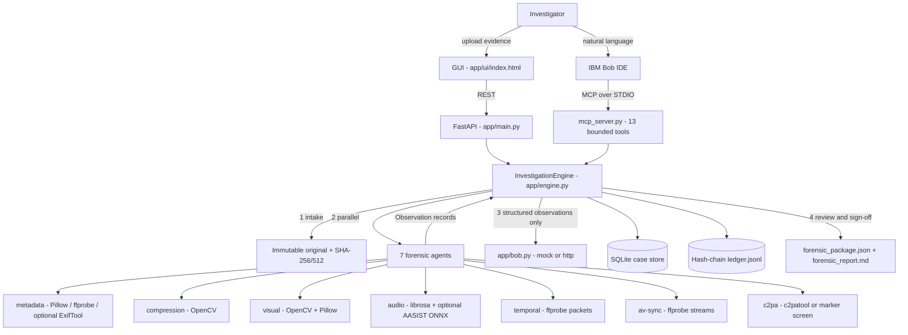

# Architecture

## Diagram

## Components
| Component | Technology | Responsibility |
|---|---|---|
| GUI | Vanilla JS/HTML | Upload, agent grid, observation review, hypotheses, gaps, report/sign-off |
| API | FastAPI + Uvicorn | REST endpoints under `/api/cases`, serves GUI |
| Engine | Python asyncio | Intake, parallel agent execution, reasoning stage, hypothesis mapping, contradictions, gaps, report compiler |
| Agents | ffprobe, OpenCV 4.x, Pillow, librosa, NumPy; `app/forensics/tooling.py` resolves ffmpeg/ffprobe/exiftool/c2patool (PATH, then common Windows dirs) | Deterministic measurements -> `Observation` records |
| Bob boundary | `app/bob.py` | Optional HTTP call to a Bob gateway (`BOB_MODE=http`) or deterministic mock; receives observations only |
| Bob MCP server | `mcp` SDK, STDIO | 13 tools: list_cases, get_case, get_agent_status, get_observations, get_hypotheses, get_contradictions, get_missing_evidence, verify_audit_ledger, start_investigation (status stub), review_observation, generate_report, get_visual_analysis, sign_off_case |
| Bob skills | `.bob/skills/*/SKILL.md` | 14 skills: orchestrator, intake, metadata, visual, audio, audio-deepfake-model, temporal, av-sync, c2pa, evidence-graph, hypothesis, adversarial verification, reporting, judge-demo |
| Case store | SQLite (`cases/cases.sqlite3`) | Serialised `CaseState` per case |
| Audit ledger | JSONL hash chain | `hash = SHA256(prev + canonical(entry))`; `verify()` walks the chain |
| Plane C library | `core/plane_c` | ACH, legal rules, custody, certificate data pack (standalone, not yet wired in) |

## End-to-end data flow
1. Evidence arrives via `POST /api/cases` (or `run.py`). The upload is streamed to a temp file, copied once into `cases/<id>/original/`, hashed, and the temp file is deleted.
2. `CASE_CREATED` is appended to the ledger. Seven agent runs are queued; temporal and A/V-sync are `not_applicable` for non-video media.
3. Agents run concurrently. Each returns observations, artifacts (raw JSON etc. with hashes) and warnings; results and failures are written to the case and to the ledger (`AGENT_COMPLETED` / `AGENT_FAILED` / `AGENT_NOT_APPLICABLE`).
4. The reasoning packet (case id, evidence id, original hash, observations, agent status — no raw media) is sent to four Bob modes: hypothesis-assessor, skeptic, adversarial, legal-proposer. In mock mode, or if HTTP fails, the deterministic fallback is used.
5. Observations are mapped to hypotheses via their `supports` / `contradicts` tags; unmapped observations are kept as uninformative; contradictions (a hypothesis with both support and contradiction) and evidence gaps (failed / not-applicable / warning agents) are computed. Status becomes `awaiting_review`.
6. The investigator (GUI) or Bob (MCP `review_observation`) records accept/reject; each action is a ledger event.
7. `generate_report` writes `forensic_package.json` (case + hashes + ledger verification + limitations) and `forensic_report.md`; sign-off sets status `complete` and appends `CASE_SIGNED_OFF`.

## Security and scalability notes
- **Untrusted input:** originals are never modified or executed; subprocesses have timeouts; the GUI escapes all media-derived text before rendering (a regression test covers it).
- **Bob is bounded:** no shell, delete or write-to-evidence tool; Bob receives observation JSON, not media; prompts inside media metadata cannot trigger tools.
- **Secrets:** `.env` is git-ignored; `.env.example` holds dummy values; no credentials in `.bob/mcp.json`.
- **Known gaps:** no API authentication or TLS (local demo); single-node SQLite/file storage; uploads read whole files for the marker-screen fallback in the C2PA agent; not load-tested. A production version would add authn/z, object storage, a job queue, and calibrated models with validation sets.
